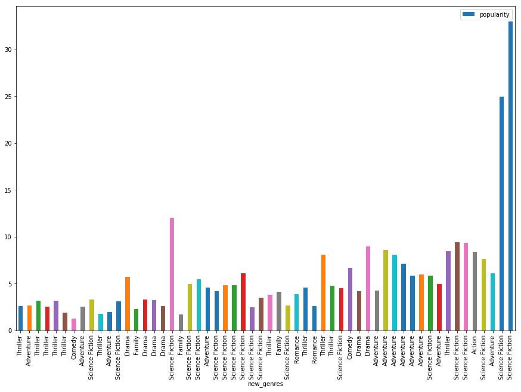
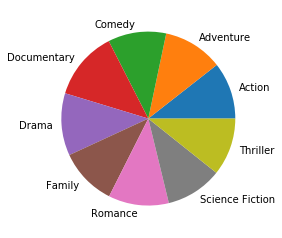
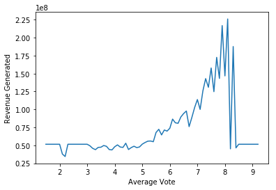

# Project: Investigate a Dataset (TMDB-Movies)

## Table of Contents
<ul>
<li><a href="#intro">Introduction</a></li>
<li><a href="#wrangling">Data Wrangling</a></li>
<li><a href="#eda">Exploratory Data Analysis</a></li>
<li><a href="#conclusions">Conclusions</a></li>
</ul>

<a id='intro'></a>
## Introduction

Selected the first data set about the imdb movies, to find out more about the kinds of movies that are expected to generate higher revenue and be a hit among the audience.

### Questions to be addressed: 
1.	Which genres were most popular from year to year ? 
2.	Is the any relationship between the type of genre and votes ?
3.	How are revenue generated and the rating the film received related ?


```python
#setting up import statements for all of the packages 
import pandas as pd
import numpy as np
import matplotlib.pyplot as plt
```

<a id='wrangling'></a>
## Data Wrangling


```python
# Load the data and print out a few lines. Perform operations to inspect data
#   types and look for instances of missing or possibly errant data.
df = pd.read_csv('C:/Users/NIDHI/Desktop/Shell/PROJECT2-Investigate A Dataset/Dataset/tmdb-movies.csv')
df.info()
sum(df.duplicated())
```

    <class 'pandas.core.frame.DataFrame'>
    RangeIndex: 10866 entries, 0 to 10865
    Data columns (total 21 columns):
    id                      10866 non-null int64
    imdb_id                 10856 non-null object
    popularity              10866 non-null float64
    budget                  10866 non-null int64
    revenue                 10866 non-null int64
    original_title          10866 non-null object
    cast                    10790 non-null object
    homepage                2936 non-null object
    director                10822 non-null object
    tagline                 8042 non-null object
    keywords                9373 non-null object
    overview                10862 non-null object
    runtime                 10866 non-null int64
    genres                  10843 non-null object
    production_companies    9836 non-null object
    release_date            10866 non-null object
    vote_count              10866 non-null int64
    vote_average            10866 non-null float64
    release_year            10866 non-null int64
    budget_adj              10866 non-null float64
    revenue_adj             10866 non-null float64
    dtypes: float64(4), int64(6), object(11)
    memory usage: 1.7+ MB
    


    1


### Data Cleaning (Checking for data types, any missing data or duplicates and for Null values!)


```python
# After discussing the structure of the data and any problems that need to be
#   cleaned, perform those cleaning steps in the second part of this section.
df.drop_duplicates(inplace=True)
df.info()
```

    <class 'pandas.core.frame.DataFrame'>
    Int64Index: 10865 entries, 0 to 10865
    Data columns (total 21 columns):
    id                      10865 non-null int64
    imdb_id                 10855 non-null object
    popularity              10865 non-null float64
    budget                  10865 non-null int64
    revenue                 10865 non-null int64
    original_title          10865 non-null object
    cast                    10789 non-null object
    homepage                2936 non-null object
    director                10821 non-null object
    tagline                 8041 non-null object
    keywords                9372 non-null object
    overview                10861 non-null object
    runtime                 10865 non-null int64
    genres                  10842 non-null object
    production_companies    9835 non-null object
    release_date            10865 non-null object
    vote_count              10865 non-null int64
    vote_average            10865 non-null float64
    release_year            10865 non-null int64
    budget_adj              10865 non-null float64
    revenue_adj             10865 non-null float64
    dtypes: float64(4), int64(6), object(11)
    memory usage: 1.8+ MB
    


```python
#Convert String to Datetime format and check to confirm:
df['release_date'] = pd.to_datetime(df['release_date'])
type(df['release_date'][0])
```


    pandas._libs.tslibs.timestamps.Timestamp


```python
#Dropping columns with NAs and Not important:
#df.drop('imdb_id','homepage',axis = 1)
column = ['id', 'popularity', 'budget', 'revenue','original_title', 'runtime','genres','release_date','release_year','vote_count','vote_average','budget_adj', 'revenue_adj', 'new_genres']
df = df[column]
df.head()
```


<div>
<style scoped>
    .dataframe tbody tr th:only-of-type {
        vertical-align: middle;
    }

    .dataframe tbody tr th {
        vertical-align: top;
    }

    .dataframe thead th {
        text-align: right;
    }
</style>
<table border="1" class="dataframe">
  <thead>
    <tr style="text-align: right;">
      <th></th>
      <th>id</th>
      <th>popularity</th>
      <th>budget</th>
      <th>revenue</th>
      <th>original_title</th>
      <th>runtime</th>
      <th>genres</th>
      <th>release_date</th>
      <th>release_year</th>
      <th>vote_count</th>
      <th>vote_average</th>
      <th>budget_adj</th>
      <th>revenue_adj</th>
      <th>new_genres</th>
    </tr>
  </thead>
  <tbody>
    <tr>
      <th>0</th>
      <td>135397</td>
      <td>32.985763</td>
      <td>150000000.0</td>
      <td>1.513529e+09</td>
      <td>Jurassic World</td>
      <td>124</td>
      <td>Action|Adventure|Science Fiction|Thriller</td>
      <td>2015-06-09</td>
      <td>2015</td>
      <td>5562</td>
      <td>6.5</td>
      <td>137999939.3</td>
      <td>1.392446e+09</td>
      <td>Science Fiction</td>
    </tr>
    <tr>
      <th>1</th>
      <td>76341</td>
      <td>28.419936</td>
      <td>150000000.0</td>
      <td>3.784364e+08</td>
      <td>Mad Max: Fury Road</td>
      <td>120</td>
      <td>Action|Adventure|Science Fiction|Thriller</td>
      <td>2015-05-13</td>
      <td>2015</td>
      <td>6185</td>
      <td>7.1</td>
      <td>137999939.3</td>
      <td>3.481613e+08</td>
      <td>Science Fiction</td>
    </tr>
    <tr>
      <th>2</th>
      <td>262500</td>
      <td>13.112507</td>
      <td>110000000.0</td>
      <td>2.952382e+08</td>
      <td>Insurgent</td>
      <td>119</td>
      <td>Adventure|Science Fiction|Thriller</td>
      <td>2015-03-18</td>
      <td>2015</td>
      <td>2480</td>
      <td>6.3</td>
      <td>101199955.5</td>
      <td>2.716190e+08</td>
      <td>Science Fiction</td>
    </tr>
    <tr>
      <th>3</th>
      <td>140607</td>
      <td>11.173104</td>
      <td>200000000.0</td>
      <td>2.068178e+09</td>
      <td>Star Wars: The Force Awakens</td>
      <td>136</td>
      <td>Action|Adventure|Science Fiction|Fantasy</td>
      <td>2015-12-15</td>
      <td>2015</td>
      <td>5292</td>
      <td>7.5</td>
      <td>183999919.0</td>
      <td>1.902723e+09</td>
      <td>Science Fiction</td>
    </tr>
    <tr>
      <th>4</th>
      <td>168259</td>
      <td>9.335014</td>
      <td>190000000.0</td>
      <td>1.506249e+09</td>
      <td>Furious 7</td>
      <td>137</td>
      <td>Action|Crime|Thriller</td>
      <td>2015-04-01</td>
      <td>2015</td>
      <td>2947</td>
      <td>7.3</td>
      <td>174799923.1</td>
      <td>1.385749e+09</td>
      <td>Thriller</td>
    </tr>
  </tbody>
</table>
</div>


```python
#Checking for columns with NAs:
sum(df['revenue_adj'].isna())
sum(df['budget_adj'].isna())
sum(df['release_year'].isna())
sum(df['vote_average'].isna())
sum(df['vote_count'].isna())
sum(df['genres'].isna())
```


    0


```python
# Drop rows with NA values:
df.dropna(inplace=True)
#Checking that column:
print(df.isnull().values.any())
```

    False
    


```python
df.describe()
mean_budget = df['budget'].mean()
mean_revenue = df['revenue'].mean()
mean_rev_adj = df['revenue_adj'].mean()
mean_bud_adj = df['budget_adj'].mean()
```


```python
#Imputing rows with zeros values:
df = df.replace({'budget': {0: mean_budget}})
df = df.replace({'revenue': {0: mean_revenue}})
df = df.replace({'revenue_adj':{0: mean_rev_adj}})
df = df.replace({'budget_adj': {0: mean_bud_adj}})
```


```python
# Filtering the Genres table using a function 
def sorted_genres(genres):
    if 'Science Fiction' in genres:
        return 'Science Fiction'
    elif 'Thriller' in genres:
        return 'Thriller'
    elif 'Documentary' in genres:
        return 'Documentary'
    elif 'Adventure' in genres:
        return 'Adventure'
    elif 'Romance' in genres:
        return 'Romance'
    elif 'Drama' in genres:
        return 'Drama'
    elif 'Action' in genres:
        return 'Action'
    elif 'Comedy' in genres:
        return 'Comedy'
    else:
        return 'Family'

df['new_genres'] = df['genres'].apply(sorted_genres)
```


```python
df
```


<div>
<style scoped>
    .dataframe tbody tr th:only-of-type {
        vertical-align: middle;
    }

    .dataframe tbody tr th {
        vertical-align: top;
    }

    .dataframe thead th {
        text-align: right;
    }
</style>
<table border="1" class="dataframe">
  <thead>
    <tr style="text-align: right;">
      <th></th>
      <th>id</th>
      <th>popularity</th>
      <th>budget</th>
      <th>revenue</th>
      <th>original_title</th>
      <th>runtime</th>
      <th>genres</th>
      <th>release_date</th>
      <th>release_year</th>
      <th>vote_count</th>
      <th>vote_average</th>
      <th>budget_adj</th>
      <th>revenue_adj</th>
      <th>new_genres</th>
    </tr>
  </thead>
  <tbody>
    <tr>
      <th>0</th>
      <td>135397</td>
      <td>32.985763</td>
      <td>1.500000e+08</td>
      <td>1.513529e+09</td>
      <td>Jurassic World</td>
      <td>124</td>
      <td>Action|Adventure|Science Fiction|Thriller</td>
      <td>2015-06-09</td>
      <td>2015</td>
      <td>5562</td>
      <td>6.5</td>
      <td>1.379999e+08</td>
      <td>1.392446e+09</td>
      <td>Science Fiction</td>
    </tr>
    <tr>
      <th>1</th>
      <td>76341</td>
      <td>28.419936</td>
      <td>1.500000e+08</td>
      <td>3.784364e+08</td>
      <td>Mad Max: Fury Road</td>
      <td>120</td>
      <td>Action|Adventure|Science Fiction|Thriller</td>
      <td>2015-05-13</td>
      <td>2015</td>
      <td>6185</td>
      <td>7.1</td>
      <td>1.379999e+08</td>
      <td>3.481613e+08</td>
      <td>Science Fiction</td>
    </tr>
    <tr>
      <th>2</th>
      <td>262500</td>
      <td>13.112507</td>
      <td>1.100000e+08</td>
      <td>2.952382e+08</td>
      <td>Insurgent</td>
      <td>119</td>
      <td>Adventure|Science Fiction|Thriller</td>
      <td>2015-03-18</td>
      <td>2015</td>
      <td>2480</td>
      <td>6.3</td>
      <td>1.012000e+08</td>
      <td>2.716190e+08</td>
      <td>Science Fiction</td>
    </tr>
    <tr>
      <th>3</th>
      <td>140607</td>
      <td>11.173104</td>
      <td>2.000000e+08</td>
      <td>2.068178e+09</td>
      <td>Star Wars: The Force Awakens</td>
      <td>136</td>
      <td>Action|Adventure|Science Fiction|Fantasy</td>
      <td>2015-12-15</td>
      <td>2015</td>
      <td>5292</td>
      <td>7.5</td>
      <td>1.839999e+08</td>
      <td>1.902723e+09</td>
      <td>Science Fiction</td>
    </tr>
    <tr>
      <th>4</th>
      <td>168259</td>
      <td>9.335014</td>
      <td>1.900000e+08</td>
      <td>1.506249e+09</td>
      <td>Furious 7</td>
      <td>137</td>
      <td>Action|Crime|Thriller</td>
      <td>2015-04-01</td>
      <td>2015</td>
      <td>2947</td>
      <td>7.3</td>
      <td>1.747999e+08</td>
      <td>1.385749e+09</td>
      <td>Thriller</td>
    </tr>
    <tr>
      <th>5</th>
      <td>281957</td>
      <td>9.110700</td>
      <td>1.350000e+08</td>
      <td>5.329505e+08</td>
      <td>The Revenant</td>
      <td>156</td>
      <td>Western|Drama|Adventure|Thriller</td>
      <td>2015-12-25</td>
      <td>2015</td>
      <td>3929</td>
      <td>7.2</td>
      <td>1.241999e+08</td>
      <td>4.903142e+08</td>
      <td>Thriller</td>
    </tr>
    <tr>
      <th>6</th>
      <td>87101</td>
      <td>8.654359</td>
      <td>1.550000e+08</td>
      <td>4.406035e+08</td>
      <td>Terminator Genisys</td>
      <td>125</td>
      <td>Science Fiction|Action|Thriller|Adventure</td>
      <td>2015-06-23</td>
      <td>2015</td>
      <td>2598</td>
      <td>5.8</td>
      <td>1.425999e+08</td>
      <td>4.053551e+08</td>
      <td>Science Fiction</td>
    </tr>
    <tr>
      <th>7</th>
      <td>286217</td>
      <td>7.667400</td>
      <td>1.080000e+08</td>
      <td>5.953803e+08</td>
      <td>The Martian</td>
      <td>141</td>
      <td>Drama|Adventure|Science Fiction</td>
      <td>2015-09-30</td>
      <td>2015</td>
      <td>4572</td>
      <td>7.6</td>
      <td>9.935996e+07</td>
      <td>5.477497e+08</td>
      <td>Science Fiction</td>
    </tr>
    <tr>
      <th>8</th>
      <td>211672</td>
      <td>7.404165</td>
      <td>7.400000e+07</td>
      <td>1.156731e+09</td>
      <td>Minions</td>
      <td>91</td>
      <td>Family|Animation|Adventure|Comedy</td>
      <td>2015-06-17</td>
      <td>2015</td>
      <td>2893</td>
      <td>6.5</td>
      <td>6.807997e+07</td>
      <td>1.064192e+09</td>
      <td>Adventure</td>
    </tr>
    <tr>
      <th>9</th>
      <td>150540</td>
      <td>6.326804</td>
      <td>1.750000e+08</td>
      <td>8.537086e+08</td>
      <td>Inside Out</td>
      <td>94</td>
      <td>Comedy|Animation|Family</td>
      <td>2015-06-09</td>
      <td>2015</td>
      <td>3935</td>
      <td>8.0</td>
      <td>1.609999e+08</td>
      <td>7.854116e+08</td>
      <td>Comedy</td>
    </tr>
    <tr>
      <th>10</th>
      <td>206647</td>
      <td>6.200282</td>
      <td>2.450000e+08</td>
      <td>8.806746e+08</td>
      <td>Spectre</td>
      <td>148</td>
      <td>Action|Adventure|Crime</td>
      <td>2015-10-26</td>
      <td>2015</td>
      <td>3254</td>
      <td>6.2</td>
      <td>2.253999e+08</td>
      <td>8.102203e+08</td>
      <td>Adventure</td>
    </tr>
    <tr>
      <th>11</th>
      <td>76757</td>
      <td>6.189369</td>
      <td>1.760000e+08</td>
      <td>1.839877e+08</td>
      <td>Jupiter Ascending</td>
      <td>124</td>
      <td>Science Fiction|Fantasy|Action|Adventure</td>
      <td>2015-02-04</td>
      <td>2015</td>
      <td>1937</td>
      <td>5.2</td>
      <td>1.619199e+08</td>
      <td>1.692686e+08</td>
      <td>Science Fiction</td>
    </tr>
    <tr>
      <th>12</th>
      <td>264660</td>
      <td>6.118847</td>
      <td>1.500000e+07</td>
      <td>3.686941e+07</td>
      <td>Ex Machina</td>
      <td>108</td>
      <td>Drama|Science Fiction</td>
      <td>2015-01-21</td>
      <td>2015</td>
      <td>2854</td>
      <td>7.6</td>
      <td>1.379999e+07</td>
      <td>3.391985e+07</td>
      <td>Science Fiction</td>
    </tr>
    <tr>
      <th>13</th>
      <td>257344</td>
      <td>5.984995</td>
      <td>8.800000e+07</td>
      <td>2.436371e+08</td>
      <td>Pixels</td>
      <td>105</td>
      <td>Action|Comedy|Science Fiction</td>
      <td>2015-07-16</td>
      <td>2015</td>
      <td>1575</td>
      <td>5.8</td>
      <td>8.095996e+07</td>
      <td>2.241460e+08</td>
      <td>Science Fiction</td>
    </tr>
    <tr>
      <th>14</th>
      <td>99861</td>
      <td>5.944927</td>
      <td>2.800000e+08</td>
      <td>1.405036e+09</td>
      <td>Avengers: Age of Ultron</td>
      <td>141</td>
      <td>Action|Adventure|Science Fiction</td>
      <td>2015-04-22</td>
      <td>2015</td>
      <td>4304</td>
      <td>7.4</td>
      <td>2.575999e+08</td>
      <td>1.292632e+09</td>
      <td>Science Fiction</td>
    </tr>
    <tr>
      <th>15</th>
      <td>273248</td>
      <td>5.898400</td>
      <td>4.400000e+07</td>
      <td>1.557601e+08</td>
      <td>The Hateful Eight</td>
      <td>167</td>
      <td>Crime|Drama|Mystery|Western</td>
      <td>2015-12-25</td>
      <td>2015</td>
      <td>2389</td>
      <td>7.4</td>
      <td>4.047998e+07</td>
      <td>1.432992e+08</td>
      <td>Drama</td>
    </tr>
    <tr>
      <th>16</th>
      <td>260346</td>
      <td>5.749758</td>
      <td>4.800000e+07</td>
      <td>3.257714e+08</td>
      <td>Taken 3</td>
      <td>109</td>
      <td>Crime|Action|Thriller</td>
      <td>2015-01-01</td>
      <td>2015</td>
      <td>1578</td>
      <td>6.1</td>
      <td>4.415998e+07</td>
      <td>2.997096e+08</td>
      <td>Thriller</td>
    </tr>
    <tr>
      <th>17</th>
      <td>102899</td>
      <td>5.573184</td>
      <td>1.300000e+08</td>
      <td>5.186022e+08</td>
      <td>Ant-Man</td>
      <td>115</td>
      <td>Science Fiction|Action|Adventure</td>
      <td>2015-07-14</td>
      <td>2015</td>
      <td>3779</td>
      <td>7.0</td>
      <td>1.195999e+08</td>
      <td>4.771138e+08</td>
      <td>Science Fiction</td>
    </tr>
    <tr>
      <th>18</th>
      <td>150689</td>
      <td>5.556818</td>
      <td>9.500000e+07</td>
      <td>5.423514e+08</td>
      <td>Cinderella</td>
      <td>112</td>
      <td>Romance|Fantasy|Family|Drama</td>
      <td>2015-03-12</td>
      <td>2015</td>
      <td>1495</td>
      <td>6.8</td>
      <td>8.739996e+07</td>
      <td>4.989630e+08</td>
      <td>Romance</td>
    </tr>
    <tr>
      <th>19</th>
      <td>131634</td>
      <td>5.476958</td>
      <td>1.600000e+08</td>
      <td>6.505234e+08</td>
      <td>The Hunger Games: Mockingjay - Part 2</td>
      <td>136</td>
      <td>War|Adventure|Science Fiction</td>
      <td>2015-11-18</td>
      <td>2015</td>
      <td>2380</td>
      <td>6.5</td>
      <td>1.471999e+08</td>
      <td>5.984813e+08</td>
      <td>Science Fiction</td>
    </tr>
    <tr>
      <th>20</th>
      <td>158852</td>
      <td>5.462138</td>
      <td>1.900000e+08</td>
      <td>2.090357e+08</td>
      <td>Tomorrowland</td>
      <td>130</td>
      <td>Action|Family|Science Fiction|Adventure|Mystery</td>
      <td>2015-05-19</td>
      <td>2015</td>
      <td>1899</td>
      <td>6.2</td>
      <td>1.747999e+08</td>
      <td>1.923127e+08</td>
      <td>Science Fiction</td>
    </tr>
    <tr>
      <th>21</th>
      <td>307081</td>
      <td>5.337064</td>
      <td>3.000000e+07</td>
      <td>9.170983e+07</td>
      <td>Southpaw</td>
      <td>123</td>
      <td>Action|Drama</td>
      <td>2015-06-15</td>
      <td>2015</td>
      <td>1386</td>
      <td>7.3</td>
      <td>2.759999e+07</td>
      <td>8.437300e+07</td>
      <td>Drama</td>
    </tr>
    <tr>
      <th>22</th>
      <td>254128</td>
      <td>4.907832</td>
      <td>1.100000e+08</td>
      <td>4.704908e+08</td>
      <td>San Andreas</td>
      <td>114</td>
      <td>Action|Drama|Thriller</td>
      <td>2015-05-27</td>
      <td>2015</td>
      <td>2060</td>
      <td>6.1</td>
      <td>1.012000e+08</td>
      <td>4.328514e+08</td>
      <td>Thriller</td>
    </tr>
    <tr>
      <th>23</th>
      <td>216015</td>
      <td>4.710402</td>
      <td>4.000000e+07</td>
      <td>5.696515e+08</td>
      <td>Fifty Shades of Grey</td>
      <td>125</td>
      <td>Drama|Romance</td>
      <td>2015-02-11</td>
      <td>2015</td>
      <td>1865</td>
      <td>5.3</td>
      <td>3.679998e+07</td>
      <td>5.240791e+08</td>
      <td>Romance</td>
    </tr>
    <tr>
      <th>24</th>
      <td>318846</td>
      <td>4.648046</td>
      <td>2.800000e+07</td>
      <td>1.333465e+08</td>
      <td>The Big Short</td>
      <td>130</td>
      <td>Comedy|Drama</td>
      <td>2015-12-11</td>
      <td>2015</td>
      <td>1545</td>
      <td>7.3</td>
      <td>2.575999e+07</td>
      <td>1.226787e+08</td>
      <td>Drama</td>
    </tr>
    <tr>
      <th>25</th>
      <td>177677</td>
      <td>4.566713</td>
      <td>1.500000e+08</td>
      <td>6.823301e+08</td>
      <td>Mission: Impossible - Rogue Nation</td>
      <td>131</td>
      <td>Action</td>
      <td>2015-07-23</td>
      <td>2015</td>
      <td>2349</td>
      <td>7.1</td>
      <td>1.379999e+08</td>
      <td>6.277435e+08</td>
      <td>Action</td>
    </tr>
    <tr>
      <th>26</th>
      <td>214756</td>
      <td>4.564549</td>
      <td>6.800000e+07</td>
      <td>2.158636e+08</td>
      <td>Ted 2</td>
      <td>115</td>
      <td>Comedy</td>
      <td>2015-06-25</td>
      <td>2015</td>
      <td>1666</td>
      <td>6.3</td>
      <td>6.255997e+07</td>
      <td>1.985944e+08</td>
      <td>Comedy</td>
    </tr>
    <tr>
      <th>27</th>
      <td>207703</td>
      <td>4.503789</td>
      <td>8.100000e+07</td>
      <td>4.038021e+08</td>
      <td>Kingsman: The Secret Service</td>
      <td>130</td>
      <td>Crime|Comedy|Action|Adventure</td>
      <td>2015-01-24</td>
      <td>2015</td>
      <td>3833</td>
      <td>7.6</td>
      <td>7.451997e+07</td>
      <td>3.714978e+08</td>
      <td>Adventure</td>
    </tr>
    <tr>
      <th>28</th>
      <td>314365</td>
      <td>4.062293</td>
      <td>2.000000e+07</td>
      <td>8.834647e+07</td>
      <td>Spotlight</td>
      <td>128</td>
      <td>Drama|Thriller|History</td>
      <td>2015-11-06</td>
      <td>2015</td>
      <td>1559</td>
      <td>7.8</td>
      <td>1.839999e+07</td>
      <td>8.127872e+07</td>
      <td>Thriller</td>
    </tr>
    <tr>
      <th>29</th>
      <td>294254</td>
      <td>3.968891</td>
      <td>6.100000e+07</td>
      <td>3.112569e+08</td>
      <td>Maze Runner: The Scorch Trials</td>
      <td>132</td>
      <td>Action|Science Fiction|Thriller</td>
      <td>2015-09-09</td>
      <td>2015</td>
      <td>1849</td>
      <td>6.4</td>
      <td>5.611998e+07</td>
      <td>2.863562e+08</td>
      <td>Science Fiction</td>
    </tr>
    <tr>
      <th>...</th>
      <td>...</td>
      <td>...</td>
      <td>...</td>
      <td>...</td>
      <td>...</td>
      <td>...</td>
      <td>...</td>
      <td>...</td>
      <td>...</td>
      <td>...</td>
      <td>...</td>
      <td>...</td>
      <td>...</td>
      <td>...</td>
    </tr>
    <tr>
      <th>10836</th>
      <td>38720</td>
      <td>0.239435</td>
      <td>1.465531e+07</td>
      <td>3.991138e+07</td>
      <td>Walk Don't Run</td>
      <td>114</td>
      <td>Comedy|Romance</td>
      <td>1966-01-01</td>
      <td>1966</td>
      <td>11</td>
      <td>5.8</td>
      <td>1.758712e+07</td>
      <td>5.147797e+07</td>
      <td>Romance</td>
    </tr>
    <tr>
      <th>10837</th>
      <td>19728</td>
      <td>0.291704</td>
      <td>1.465531e+07</td>
      <td>3.991138e+07</td>
      <td>The Blue Max</td>
      <td>156</td>
      <td>War|Action|Adventure|Drama</td>
      <td>2066-06-21</td>
      <td>1966</td>
      <td>12</td>
      <td>5.5</td>
      <td>1.758712e+07</td>
      <td>5.147797e+07</td>
      <td>Adventure</td>
    </tr>
    <tr>
      <th>10838</th>
      <td>22383</td>
      <td>0.151845</td>
      <td>1.465531e+07</td>
      <td>3.991138e+07</td>
      <td>The Professionals</td>
      <td>117</td>
      <td>Action|Adventure|Western</td>
      <td>1966-11-01</td>
      <td>1966</td>
      <td>21</td>
      <td>6.0</td>
      <td>1.758712e+07</td>
      <td>5.147797e+07</td>
      <td>Adventure</td>
    </tr>
    <tr>
      <th>10839</th>
      <td>13353</td>
      <td>0.276133</td>
      <td>1.465531e+07</td>
      <td>3.991138e+07</td>
      <td>It's the Great Pumpkin, Charlie Brown</td>
      <td>25</td>
      <td>Family|Animation</td>
      <td>2066-10-27</td>
      <td>1966</td>
      <td>49</td>
      <td>7.2</td>
      <td>1.758712e+07</td>
      <td>5.147797e+07</td>
      <td>Family</td>
    </tr>
    <tr>
      <th>10840</th>
      <td>34388</td>
      <td>0.102530</td>
      <td>1.465531e+07</td>
      <td>3.991138e+07</td>
      <td>Funeral in Berlin</td>
      <td>102</td>
      <td>Thriller</td>
      <td>2066-12-22</td>
      <td>1966</td>
      <td>13</td>
      <td>5.7</td>
      <td>1.758712e+07</td>
      <td>5.147797e+07</td>
      <td>Thriller</td>
    </tr>
    <tr>
      <th>10841</th>
      <td>42701</td>
      <td>0.264925</td>
      <td>7.500000e+04</td>
      <td>3.991138e+07</td>
      <td>The Shooting</td>
      <td>82</td>
      <td>Western</td>
      <td>2066-10-23</td>
      <td>1966</td>
      <td>12</td>
      <td>5.5</td>
      <td>5.038511e+05</td>
      <td>5.147797e+07</td>
      <td>Family</td>
    </tr>
    <tr>
      <th>10842</th>
      <td>36540</td>
      <td>0.253437</td>
      <td>1.465531e+07</td>
      <td>3.991138e+07</td>
      <td>Winnie the Pooh and the Honey Tree</td>
      <td>25</td>
      <td>Animation|Family</td>
      <td>1966-01-01</td>
      <td>1966</td>
      <td>12</td>
      <td>7.9</td>
      <td>1.758712e+07</td>
      <td>5.147797e+07</td>
      <td>Family</td>
    </tr>
    <tr>
      <th>10843</th>
      <td>29710</td>
      <td>0.252399</td>
      <td>1.465531e+07</td>
      <td>3.991138e+07</td>
      <td>Khartoum</td>
      <td>134</td>
      <td>Adventure|Drama|War|History|Action</td>
      <td>1966-06-09</td>
      <td>1966</td>
      <td>12</td>
      <td>5.8</td>
      <td>1.758712e+07</td>
      <td>5.147797e+07</td>
      <td>Adventure</td>
    </tr>
    <tr>
      <th>10844</th>
      <td>23728</td>
      <td>0.236098</td>
      <td>1.465531e+07</td>
      <td>3.991138e+07</td>
      <td>Our Man Flint</td>
      <td>108</td>
      <td>Adventure|Comedy|Fantasy|Science Fiction</td>
      <td>2066-01-16</td>
      <td>1966</td>
      <td>13</td>
      <td>5.6</td>
      <td>1.758712e+07</td>
      <td>5.147797e+07</td>
      <td>Science Fiction</td>
    </tr>
    <tr>
      <th>10845</th>
      <td>5065</td>
      <td>0.230873</td>
      <td>1.465531e+07</td>
      <td>3.991138e+07</td>
      <td>Carry On Cowboy</td>
      <td>93</td>
      <td>Comedy|Western</td>
      <td>1966-03-01</td>
      <td>1966</td>
      <td>15</td>
      <td>5.9</td>
      <td>1.758712e+07</td>
      <td>5.147797e+07</td>
      <td>Comedy</td>
    </tr>
    <tr>
      <th>10846</th>
      <td>17102</td>
      <td>0.212716</td>
      <td>1.465531e+07</td>
      <td>3.991138e+07</td>
      <td>Dracula: Prince of Darkness</td>
      <td>90</td>
      <td>Horror</td>
      <td>1966-01-09</td>
      <td>1966</td>
      <td>16</td>
      <td>5.7</td>
      <td>1.758712e+07</td>
      <td>5.147797e+07</td>
      <td>Family</td>
    </tr>
    <tr>
      <th>10847</th>
      <td>28763</td>
      <td>0.034555</td>
      <td>1.465531e+07</td>
      <td>3.991138e+07</td>
      <td>Island of Terror</td>
      <td>89</td>
      <td>Science Fiction|Horror</td>
      <td>2066-06-20</td>
      <td>1966</td>
      <td>13</td>
      <td>5.3</td>
      <td>1.758712e+07</td>
      <td>5.147797e+07</td>
      <td>Science Fiction</td>
    </tr>
    <tr>
      <th>10848</th>
      <td>2161</td>
      <td>0.207257</td>
      <td>5.115000e+06</td>
      <td>1.200000e+07</td>
      <td>Fantastic Voyage</td>
      <td>100</td>
      <td>Adventure|Science Fiction</td>
      <td>2066-08-24</td>
      <td>1966</td>
      <td>42</td>
      <td>6.7</td>
      <td>3.436265e+07</td>
      <td>8.061618e+07</td>
      <td>Science Fiction</td>
    </tr>
    <tr>
      <th>10849</th>
      <td>28270</td>
      <td>0.206537</td>
      <td>1.465531e+07</td>
      <td>3.991138e+07</td>
      <td>Gambit</td>
      <td>109</td>
      <td>Action|Comedy|Crime</td>
      <td>2066-12-16</td>
      <td>1966</td>
      <td>14</td>
      <td>6.1</td>
      <td>1.758712e+07</td>
      <td>5.147797e+07</td>
      <td>Action</td>
    </tr>
    <tr>
      <th>10850</th>
      <td>26268</td>
      <td>0.202473</td>
      <td>1.465531e+07</td>
      <td>3.991138e+07</td>
      <td>Harper</td>
      <td>121</td>
      <td>Action|Drama|Thriller|Crime|Mystery</td>
      <td>2066-02-23</td>
      <td>1966</td>
      <td>14</td>
      <td>6.0</td>
      <td>1.758712e+07</td>
      <td>5.147797e+07</td>
      <td>Thriller</td>
    </tr>
    <tr>
      <th>10851</th>
      <td>15347</td>
      <td>0.342791</td>
      <td>1.465531e+07</td>
      <td>3.991138e+07</td>
      <td>Born Free</td>
      <td>95</td>
      <td>Adventure|Drama|Action|Family|Foreign</td>
      <td>2066-06-22</td>
      <td>1966</td>
      <td>15</td>
      <td>6.6</td>
      <td>1.758712e+07</td>
      <td>5.147797e+07</td>
      <td>Adventure</td>
    </tr>
    <tr>
      <th>10852</th>
      <td>37301</td>
      <td>0.227220</td>
      <td>1.465531e+07</td>
      <td>3.991138e+07</td>
      <td>A Big Hand for the Little Lady</td>
      <td>95</td>
      <td>Western</td>
      <td>2066-05-31</td>
      <td>1966</td>
      <td>11</td>
      <td>6.0</td>
      <td>1.758712e+07</td>
      <td>5.147797e+07</td>
      <td>Family</td>
    </tr>
    <tr>
      <th>10853</th>
      <td>15598</td>
      <td>0.163592</td>
      <td>1.465531e+07</td>
      <td>3.991138e+07</td>
      <td>Alfie</td>
      <td>114</td>
      <td>Comedy|Drama|Romance</td>
      <td>2066-03-29</td>
      <td>1966</td>
      <td>26</td>
      <td>6.2</td>
      <td>1.758712e+07</td>
      <td>5.147797e+07</td>
      <td>Romance</td>
    </tr>
    <tr>
      <th>10854</th>
      <td>31602</td>
      <td>0.146402</td>
      <td>1.465531e+07</td>
      <td>3.991138e+07</td>
      <td>The Chase</td>
      <td>135</td>
      <td>Thriller|Drama|Crime</td>
      <td>2066-02-17</td>
      <td>1966</td>
      <td>17</td>
      <td>6.0</td>
      <td>1.758712e+07</td>
      <td>5.147797e+07</td>
      <td>Thriller</td>
    </tr>
    <tr>
      <th>10855</th>
      <td>13343</td>
      <td>0.141026</td>
      <td>7.000000e+05</td>
      <td>3.991138e+07</td>
      <td>The Ghost &amp; Mr. Chicken</td>
      <td>90</td>
      <td>Comedy|Family|Mystery|Romance</td>
      <td>2066-01-20</td>
      <td>1966</td>
      <td>14</td>
      <td>6.1</td>
      <td>4.702610e+06</td>
      <td>5.147797e+07</td>
      <td>Romance</td>
    </tr>
    <tr>
      <th>10856</th>
      <td>20277</td>
      <td>0.140934</td>
      <td>1.465531e+07</td>
      <td>3.991138e+07</td>
      <td>The Ugly Dachshund</td>
      <td>93</td>
      <td>Comedy|Drama|Family</td>
      <td>2066-02-16</td>
      <td>1966</td>
      <td>14</td>
      <td>5.7</td>
      <td>1.758712e+07</td>
      <td>5.147797e+07</td>
      <td>Drama</td>
    </tr>
    <tr>
      <th>10857</th>
      <td>5921</td>
      <td>0.131378</td>
      <td>1.465531e+07</td>
      <td>3.991138e+07</td>
      <td>Nevada Smith</td>
      <td>128</td>
      <td>Action|Western</td>
      <td>1966-06-10</td>
      <td>1966</td>
      <td>10</td>
      <td>5.9</td>
      <td>1.758712e+07</td>
      <td>5.147797e+07</td>
      <td>Action</td>
    </tr>
    <tr>
      <th>10858</th>
      <td>31918</td>
      <td>0.317824</td>
      <td>1.465531e+07</td>
      <td>3.991138e+07</td>
      <td>The Russians Are Coming, The Russians Are Coming</td>
      <td>126</td>
      <td>Comedy|War</td>
      <td>2066-05-25</td>
      <td>1966</td>
      <td>11</td>
      <td>5.5</td>
      <td>1.758712e+07</td>
      <td>5.147797e+07</td>
      <td>Comedy</td>
    </tr>
    <tr>
      <th>10859</th>
      <td>20620</td>
      <td>0.089072</td>
      <td>1.465531e+07</td>
      <td>3.991138e+07</td>
      <td>Seconds</td>
      <td>100</td>
      <td>Mystery|Science Fiction|Thriller|Drama</td>
      <td>1966-10-05</td>
      <td>1966</td>
      <td>22</td>
      <td>6.6</td>
      <td>1.758712e+07</td>
      <td>5.147797e+07</td>
      <td>Science Fiction</td>
    </tr>
    <tr>
      <th>10860</th>
      <td>5060</td>
      <td>0.087034</td>
      <td>1.465531e+07</td>
      <td>3.991138e+07</td>
      <td>Carry On Screaming!</td>
      <td>87</td>
      <td>Comedy</td>
      <td>2066-05-20</td>
      <td>1966</td>
      <td>13</td>
      <td>7.0</td>
      <td>1.758712e+07</td>
      <td>5.147797e+07</td>
      <td>Comedy</td>
    </tr>
    <tr>
      <th>10861</th>
      <td>21</td>
      <td>0.080598</td>
      <td>1.465531e+07</td>
      <td>3.991138e+07</td>
      <td>The Endless Summer</td>
      <td>95</td>
      <td>Documentary</td>
      <td>2066-06-15</td>
      <td>1966</td>
      <td>11</td>
      <td>7.4</td>
      <td>1.758712e+07</td>
      <td>5.147797e+07</td>
      <td>Documentary</td>
    </tr>
    <tr>
      <th>10862</th>
      <td>20379</td>
      <td>0.065543</td>
      <td>1.465531e+07</td>
      <td>3.991138e+07</td>
      <td>Grand Prix</td>
      <td>176</td>
      <td>Action|Adventure|Drama</td>
      <td>2066-12-21</td>
      <td>1966</td>
      <td>20</td>
      <td>5.7</td>
      <td>1.758712e+07</td>
      <td>5.147797e+07</td>
      <td>Adventure</td>
    </tr>
    <tr>
      <th>10863</th>
      <td>39768</td>
      <td>0.065141</td>
      <td>1.465531e+07</td>
      <td>3.991138e+07</td>
      <td>Beregis Avtomobilya</td>
      <td>94</td>
      <td>Mystery|Comedy</td>
      <td>1966-01-01</td>
      <td>1966</td>
      <td>11</td>
      <td>6.5</td>
      <td>1.758712e+07</td>
      <td>5.147797e+07</td>
      <td>Comedy</td>
    </tr>
    <tr>
      <th>10864</th>
      <td>21449</td>
      <td>0.064317</td>
      <td>1.465531e+07</td>
      <td>3.991138e+07</td>
      <td>What's Up, Tiger Lily?</td>
      <td>80</td>
      <td>Action|Comedy</td>
      <td>1966-11-02</td>
      <td>1966</td>
      <td>22</td>
      <td>5.4</td>
      <td>1.758712e+07</td>
      <td>5.147797e+07</td>
      <td>Action</td>
    </tr>
    <tr>
      <th>10865</th>
      <td>22293</td>
      <td>0.035919</td>
      <td>1.900000e+04</td>
      <td>3.991138e+07</td>
      <td>Manos: The Hands of Fate</td>
      <td>74</td>
      <td>Horror</td>
      <td>2066-11-15</td>
      <td>1966</td>
      <td>15</td>
      <td>1.5</td>
      <td>1.276423e+05</td>
      <td>5.147797e+07</td>
      <td>Family</td>
    </tr>
  </tbody>
</table>
<p>10842 rows × 14 columns</p>
</div>


# <a id='eda'></a>
## Exploratory Data Analysis


### Research Questions : Which genres are most popular from year to year?


```python
# Filtering only the genres,release year and popularity 
col = ['release_year', 'popularity', 'new_genres']
df_genres = df[col]

#Grouping by release year and getting the most popular genre for that year:
df_genres_pop = df_genres.loc[df_genres.groupby(['release_year'])['popularity'].idxmax()]
df_genres_pop
```


<div>
<style scoped>
    .dataframe tbody tr th:only-of-type {
        vertical-align: middle;
    }

    .dataframe tbody tr th {
        vertical-align: top;
    }

    .dataframe thead th {
        text-align: right;
    }
</style>
<table border="1" class="dataframe">
  <thead>
    <tr style="text-align: right;">
      <th></th>
      <th>release_year</th>
      <th>popularity</th>
      <th>new_genres</th>
    </tr>
  </thead>
  <tbody>
    <tr>
      <th>10141</th>
      <td>1960</td>
      <td>2.610362</td>
      <td>Thriller</td>
    </tr>
    <tr>
      <th>10110</th>
      <td>1961</td>
      <td>2.631987</td>
      <td>Adventure</td>
    </tr>
    <tr>
      <th>9849</th>
      <td>1962</td>
      <td>3.170651</td>
      <td>Thriller</td>
    </tr>
    <tr>
      <th>10438</th>
      <td>1963</td>
      <td>2.508235</td>
      <td>Thriller</td>
    </tr>
    <tr>
      <th>9881</th>
      <td>1964</td>
      <td>3.153791</td>
      <td>Thriller</td>
    </tr>
    <tr>
      <th>10689</th>
      <td>1965</td>
      <td>1.910465</td>
      <td>Thriller</td>
    </tr>
    <tr>
      <th>10820</th>
      <td>1966</td>
      <td>1.227582</td>
      <td>Comedy</td>
    </tr>
    <tr>
      <th>10398</th>
      <td>1967</td>
      <td>2.550704</td>
      <td>Adventure</td>
    </tr>
    <tr>
      <th>9719</th>
      <td>1968</td>
      <td>3.309196</td>
      <td>Science Fiction</td>
    </tr>
    <tr>
      <th>10724</th>
      <td>1969</td>
      <td>1.778746</td>
      <td>Thriller</td>
    </tr>
    <tr>
      <th>10648</th>
      <td>1970</td>
      <td>1.936962</td>
      <td>Adventure</td>
    </tr>
    <tr>
      <th>9923</th>
      <td>1971</td>
      <td>3.072555</td>
      <td>Science Fiction</td>
    </tr>
    <tr>
      <th>7269</th>
      <td>1972</td>
      <td>5.738034</td>
      <td>Drama</td>
    </tr>
    <tr>
      <th>10593</th>
      <td>1973</td>
      <td>2.272486</td>
      <td>Family</td>
    </tr>
    <tr>
      <th>9758</th>
      <td>1974</td>
      <td>3.264571</td>
      <td>Drama</td>
    </tr>
    <tr>
      <th>9805</th>
      <td>1975</td>
      <td>3.258151</td>
      <td>Drama</td>
    </tr>
    <tr>
      <th>10173</th>
      <td>1976</td>
      <td>2.582657</td>
      <td>Drama</td>
    </tr>
    <tr>
      <th>1329</th>
      <td>1977</td>
      <td>12.037933</td>
      <td>Science Fiction</td>
    </tr>
    <tr>
      <th>10755</th>
      <td>1978</td>
      <td>1.697618</td>
      <td>Family</td>
    </tr>
    <tr>
      <th>7825</th>
      <td>1979</td>
      <td>4.935897</td>
      <td>Science Fiction</td>
    </tr>
    <tr>
      <th>7309</th>
      <td>1980</td>
      <td>5.488441</td>
      <td>Science Fiction</td>
    </tr>
    <tr>
      <th>8375</th>
      <td>1981</td>
      <td>4.578300</td>
      <td>Adventure</td>
    </tr>
    <tr>
      <th>8888</th>
      <td>1982</td>
      <td>4.215642</td>
      <td>Science Fiction</td>
    </tr>
    <tr>
      <th>7987</th>
      <td>1983</td>
      <td>4.828854</td>
      <td>Science Fiction</td>
    </tr>
    <tr>
      <th>7882</th>
      <td>1984</td>
      <td>4.831966</td>
      <td>Science Fiction</td>
    </tr>
    <tr>
      <th>6081</th>
      <td>1985</td>
      <td>6.095293</td>
      <td>Science Fiction</td>
    </tr>
    <tr>
      <th>10472</th>
      <td>1986</td>
      <td>2.485419</td>
      <td>Science Fiction</td>
    </tr>
    <tr>
      <th>9594</th>
      <td>1987</td>
      <td>3.474728</td>
      <td>Science Fiction</td>
    </tr>
    <tr>
      <th>9449</th>
      <td>1988</td>
      <td>3.777441</td>
      <td>Thriller</td>
    </tr>
    <tr>
      <th>9179</th>
      <td>1989</td>
      <td>4.143585</td>
      <td>Family</td>
    </tr>
    <tr>
      <th>9978</th>
      <td>1990</td>
      <td>2.679627</td>
      <td>Science Fiction</td>
    </tr>
    <tr>
      <th>9316</th>
      <td>1991</td>
      <td>3.852269</td>
      <td>Romance</td>
    </tr>
    <tr>
      <th>8242</th>
      <td>1992</td>
      <td>4.586426</td>
      <td>Thriller</td>
    </tr>
    <tr>
      <th>10220</th>
      <td>1993</td>
      <td>2.571339</td>
      <td>Romance</td>
    </tr>
    <tr>
      <th>4177</th>
      <td>1994</td>
      <td>8.093754</td>
      <td>Thriller</td>
    </tr>
    <tr>
      <th>8067</th>
      <td>1995</td>
      <td>4.765359</td>
      <td>Thriller</td>
    </tr>
    <tr>
      <th>8457</th>
      <td>1996</td>
      <td>4.480733</td>
      <td>Science Fiction</td>
    </tr>
    <tr>
      <th>5230</th>
      <td>1997</td>
      <td>6.668990</td>
      <td>Comedy</td>
    </tr>
    <tr>
      <th>8969</th>
      <td>1998</td>
      <td>4.180540</td>
      <td>Drama</td>
    </tr>
    <tr>
      <th>2409</th>
      <td>1999</td>
      <td>8.947905</td>
      <td>Drama</td>
    </tr>
    <tr>
      <th>8661</th>
      <td>2000</td>
      <td>4.271452</td>
      <td>Adventure</td>
    </tr>
    <tr>
      <th>2633</th>
      <td>2001</td>
      <td>8.575419</td>
      <td>Adventure</td>
    </tr>
    <tr>
      <th>3911</th>
      <td>2002</td>
      <td>8.095275</td>
      <td>Adventure</td>
    </tr>
    <tr>
      <th>4949</th>
      <td>2003</td>
      <td>7.122455</td>
      <td>Adventure</td>
    </tr>
    <tr>
      <th>6962</th>
      <td>2004</td>
      <td>5.827781</td>
      <td>Adventure</td>
    </tr>
    <tr>
      <th>6190</th>
      <td>2005</td>
      <td>5.939927</td>
      <td>Adventure</td>
    </tr>
    <tr>
      <th>6554</th>
      <td>2006</td>
      <td>5.838503</td>
      <td>Science Fiction</td>
    </tr>
    <tr>
      <th>7387</th>
      <td>2007</td>
      <td>4.965391</td>
      <td>Adventure</td>
    </tr>
    <tr>
      <th>2875</th>
      <td>2008</td>
      <td>8.466668</td>
      <td>Thriller</td>
    </tr>
    <tr>
      <th>1386</th>
      <td>2009</td>
      <td>9.432768</td>
      <td>Science Fiction</td>
    </tr>
    <tr>
      <th>1919</th>
      <td>2010</td>
      <td>9.363643</td>
      <td>Science Fiction</td>
    </tr>
    <tr>
      <th>3371</th>
      <td>2011</td>
      <td>8.411577</td>
      <td>Action</td>
    </tr>
    <tr>
      <th>4361</th>
      <td>2012</td>
      <td>7.637767</td>
      <td>Science Fiction</td>
    </tr>
    <tr>
      <th>5422</th>
      <td>2013</td>
      <td>6.112766</td>
      <td>Adventure</td>
    </tr>
    <tr>
      <th>629</th>
      <td>2014</td>
      <td>24.949134</td>
      <td>Science Fiction</td>
    </tr>
    <tr>
      <th>0</th>
      <td>2015</td>
      <td>32.985763</td>
      <td>Science Fiction</td>
    </tr>
  </tbody>
</table>
</div>


```python
# Plotting the bar graph to check popularity of genres over years.
df_genres_pop.plot(y='popularity', x='new_genres', kind ='bar', style ='list',xticks =df_genres_pop['release_year'], figsize=(15,10))
```


    <matplotlib.axes._subplots.AxesSubplot at 0x23646df36a0>





### Which genre of movies have higher votes?


```python
#Filtering out the columns required
df_01 = df[['vote_average', 'new_genres']]
df_01
```


<div>
<style scoped>
    .dataframe tbody tr th:only-of-type {
        vertical-align: middle;
    }

    .dataframe tbody tr th {
        vertical-align: top;
    }

    .dataframe thead th {
        text-align: right;
    }
</style>
<table border="1" class="dataframe">
  <thead>
    <tr style="text-align: right;">
      <th></th>
      <th>vote_average</th>
      <th>new_genres</th>
    </tr>
  </thead>
  <tbody>
    <tr>
      <th>0</th>
      <td>6.5</td>
      <td>Science Fiction</td>
    </tr>
    <tr>
      <th>1</th>
      <td>7.1</td>
      <td>Science Fiction</td>
    </tr>
    <tr>
      <th>2</th>
      <td>6.3</td>
      <td>Science Fiction</td>
    </tr>
    <tr>
      <th>3</th>
      <td>7.5</td>
      <td>Science Fiction</td>
    </tr>
    <tr>
      <th>4</th>
      <td>7.3</td>
      <td>Thriller</td>
    </tr>
    <tr>
      <th>5</th>
      <td>7.2</td>
      <td>Thriller</td>
    </tr>
    <tr>
      <th>6</th>
      <td>5.8</td>
      <td>Science Fiction</td>
    </tr>
    <tr>
      <th>7</th>
      <td>7.6</td>
      <td>Science Fiction</td>
    </tr>
    <tr>
      <th>8</th>
      <td>6.5</td>
      <td>Adventure</td>
    </tr>
    <tr>
      <th>9</th>
      <td>8.0</td>
      <td>Comedy</td>
    </tr>
    <tr>
      <th>10</th>
      <td>6.2</td>
      <td>Adventure</td>
    </tr>
    <tr>
      <th>11</th>
      <td>5.2</td>
      <td>Science Fiction</td>
    </tr>
    <tr>
      <th>12</th>
      <td>7.6</td>
      <td>Science Fiction</td>
    </tr>
    <tr>
      <th>13</th>
      <td>5.8</td>
      <td>Science Fiction</td>
    </tr>
    <tr>
      <th>14</th>
      <td>7.4</td>
      <td>Science Fiction</td>
    </tr>
    <tr>
      <th>15</th>
      <td>7.4</td>
      <td>Drama</td>
    </tr>
    <tr>
      <th>16</th>
      <td>6.1</td>
      <td>Thriller</td>
    </tr>
    <tr>
      <th>17</th>
      <td>7.0</td>
      <td>Science Fiction</td>
    </tr>
    <tr>
      <th>18</th>
      <td>6.8</td>
      <td>Romance</td>
    </tr>
    <tr>
      <th>19</th>
      <td>6.5</td>
      <td>Science Fiction</td>
    </tr>
    <tr>
      <th>20</th>
      <td>6.2</td>
      <td>Science Fiction</td>
    </tr>
    <tr>
      <th>21</th>
      <td>7.3</td>
      <td>Drama</td>
    </tr>
    <tr>
      <th>22</th>
      <td>6.1</td>
      <td>Thriller</td>
    </tr>
    <tr>
      <th>23</th>
      <td>5.3</td>
      <td>Romance</td>
    </tr>
    <tr>
      <th>24</th>
      <td>7.3</td>
      <td>Drama</td>
    </tr>
    <tr>
      <th>25</th>
      <td>7.1</td>
      <td>Action</td>
    </tr>
    <tr>
      <th>26</th>
      <td>6.3</td>
      <td>Comedy</td>
    </tr>
    <tr>
      <th>27</th>
      <td>7.6</td>
      <td>Adventure</td>
    </tr>
    <tr>
      <th>28</th>
      <td>7.8</td>
      <td>Thriller</td>
    </tr>
    <tr>
      <th>29</th>
      <td>6.4</td>
      <td>Science Fiction</td>
    </tr>
    <tr>
      <th>...</th>
      <td>...</td>
      <td>...</td>
    </tr>
    <tr>
      <th>10836</th>
      <td>5.8</td>
      <td>Romance</td>
    </tr>
    <tr>
      <th>10837</th>
      <td>5.5</td>
      <td>Adventure</td>
    </tr>
    <tr>
      <th>10838</th>
      <td>6.0</td>
      <td>Adventure</td>
    </tr>
    <tr>
      <th>10839</th>
      <td>7.2</td>
      <td>Family</td>
    </tr>
    <tr>
      <th>10840</th>
      <td>5.7</td>
      <td>Thriller</td>
    </tr>
    <tr>
      <th>10841</th>
      <td>5.5</td>
      <td>Family</td>
    </tr>
    <tr>
      <th>10842</th>
      <td>7.9</td>
      <td>Family</td>
    </tr>
    <tr>
      <th>10843</th>
      <td>5.8</td>
      <td>Adventure</td>
    </tr>
    <tr>
      <th>10844</th>
      <td>5.6</td>
      <td>Science Fiction</td>
    </tr>
    <tr>
      <th>10845</th>
      <td>5.9</td>
      <td>Comedy</td>
    </tr>
    <tr>
      <th>10846</th>
      <td>5.7</td>
      <td>Family</td>
    </tr>
    <tr>
      <th>10847</th>
      <td>5.3</td>
      <td>Science Fiction</td>
    </tr>
    <tr>
      <th>10848</th>
      <td>6.7</td>
      <td>Science Fiction</td>
    </tr>
    <tr>
      <th>10849</th>
      <td>6.1</td>
      <td>Action</td>
    </tr>
    <tr>
      <th>10850</th>
      <td>6.0</td>
      <td>Thriller</td>
    </tr>
    <tr>
      <th>10851</th>
      <td>6.6</td>
      <td>Adventure</td>
    </tr>
    <tr>
      <th>10852</th>
      <td>6.0</td>
      <td>Family</td>
    </tr>
    <tr>
      <th>10853</th>
      <td>6.2</td>
      <td>Romance</td>
    </tr>
    <tr>
      <th>10854</th>
      <td>6.0</td>
      <td>Thriller</td>
    </tr>
    <tr>
      <th>10855</th>
      <td>6.1</td>
      <td>Romance</td>
    </tr>
    <tr>
      <th>10856</th>
      <td>5.7</td>
      <td>Drama</td>
    </tr>
    <tr>
      <th>10857</th>
      <td>5.9</td>
      <td>Action</td>
    </tr>
    <tr>
      <th>10858</th>
      <td>5.5</td>
      <td>Comedy</td>
    </tr>
    <tr>
      <th>10859</th>
      <td>6.6</td>
      <td>Science Fiction</td>
    </tr>
    <tr>
      <th>10860</th>
      <td>7.0</td>
      <td>Comedy</td>
    </tr>
    <tr>
      <th>10861</th>
      <td>7.4</td>
      <td>Documentary</td>
    </tr>
    <tr>
      <th>10862</th>
      <td>5.7</td>
      <td>Adventure</td>
    </tr>
    <tr>
      <th>10863</th>
      <td>6.5</td>
      <td>Comedy</td>
    </tr>
    <tr>
      <th>10864</th>
      <td>5.4</td>
      <td>Action</td>
    </tr>
    <tr>
      <th>10865</th>
      <td>1.5</td>
      <td>Family</td>
    </tr>
  </tbody>
</table>
<p>10842 rows × 2 columns</p>
</div>


```python
#Grouping and finding mean of each category of genre:
df_mean = df_01.groupby('new_genres').mean()
df_mean.head()
```


<div>
<style scoped>
    .dataframe tbody tr th:only-of-type {
        vertical-align: middle;
    }

    .dataframe tbody tr th {
        vertical-align: top;
    }

    .dataframe thead th {
        text-align: right;
    }
</style>
<table border="1" class="dataframe">
  <thead>
    <tr style="text-align: right;">
      <th></th>
      <th>vote_average</th>
    </tr>
    <tr>
      <th>new_genres</th>
      <th></th>
    </tr>
  </thead>
  <tbody>
    <tr>
      <th>Action</th>
      <td>5.713803</td>
    </tr>
    <tr>
      <th>Adventure</th>
      <td>6.004640</td>
    </tr>
    <tr>
      <th>Comedy</th>
      <td>5.841880</td>
    </tr>
    <tr>
      <th>Documentary</th>
      <td>6.907422</td>
    </tr>
    <tr>
      <th>Drama</th>
      <td>6.259618</td>
    </tr>
  </tbody>
</table>
</div>


```python
# Plotting a pie chart to check for each category of genre: 
plt.pie(df_mean,  labels=['Action','Adventure','Comedy','Documentary','Drama','Family','Romance','Science Fiction','Thriller'], autopct=None, wedgeprops=None, textprops=None)
```


    ([<matplotlib.patches.Wedge at 0x236426549b0>,
      <matplotlib.patches.Wedge at 0x23642654eb8>,
      <matplotlib.patches.Wedge at 0x2364265d3c8>,
      <matplotlib.patches.Wedge at 0x2364265d898>,
      <matplotlib.patches.Wedge at 0x2364265dd68>,
      <matplotlib.patches.Wedge at 0x23642666278>,
      <matplotlib.patches.Wedge at 0x23642666748>,
      <matplotlib.patches.Wedge at 0x23642666c18>,
      <matplotlib.patches.Wedge at 0x23642670128>],
     [Text(1.0398111929051184, 0.35887697489423126, 'Action'),
      Text(0.5813878104682809, 0.9338030915770725, 'Adventure'),
      Text(-0.14495745436048643, 1.0904069590869858, 'Comedy'),
      Text(-0.8433876321593868, 0.7061850337698916, 'Documentary'),
      Text(-1.0974008925026053, -0.0755730185614249, 'Drama'),
      Text(-0.7910408933942973, -0.7643652955086018, 'Family'),
      Text(-0.12529200517863745, -1.0928412114476267, 'Romance'),
      Text(0.5920830553323436, -0.9270586041822368, 'Science Fiction'),
      Text(1.038326408553683, -0.36315047748834184, 'Thriller')])





## 3. How are revenue generated and the rating the film received related ??


```python
# Grouping revenue by vote average and finding mean :
df_02 = df[['revenue_adj', 'vote_average']]
df_mean02 = df_02.groupby('vote_average').mean()
df_mean02.head()
```


<div>
<style scoped>
    .dataframe tbody tr th:only-of-type {
        vertical-align: middle;
    }

    .dataframe tbody tr th {
        vertical-align: top;
    }

    .dataframe thead th {
        text-align: right;
    }
</style>
<table border="1" class="dataframe">
  <thead>
    <tr style="text-align: right;">
      <th></th>
      <th>revenue_adj</th>
    </tr>
    <tr>
      <th>vote_average</th>
      <th></th>
    </tr>
  </thead>
  <tbody>
    <tr>
      <th>1.5</th>
      <td>5.147797e+07</td>
    </tr>
    <tr>
      <th>2.0</th>
      <td>5.147797e+07</td>
    </tr>
    <tr>
      <th>2.1</th>
      <td>3.782405e+07</td>
    </tr>
    <tr>
      <th>2.2</th>
      <td>3.434198e+07</td>
    </tr>
    <tr>
      <th>2.3</th>
      <td>5.147797e+07</td>
    </tr>
  </tbody>
</table>
</div>


```python
# Now plot a simple line graph to check for any correalation between the two parameters:
plt.plot(df_mean02, scalex=True, scaley=True)
plt.xlabel('Average Vote')
plt.ylabel('Revenue Generated')
```


    Text(0, 0.5, 'Revenue Generated')





<a id='conclusions'></a>
## Conclusions
1. From the bar graph, it is clear that the genre of "Science Fiction" has gained more popularity over the years.
2. From the second graph which is a pie chart, we can conclude easily that there is no relation as such between genres type and their voting pattern, since all the different genres have similar voting averages.
3. From the last line graph, it is clear that the movies which receive higher votes have done well at the profit end as well and have generated higher revenues.


```python
from subprocess import call
call(['python', '-m', 'nbconvert', 'Investigate_a_Dataset.ipynb'])
```


    4294967295


